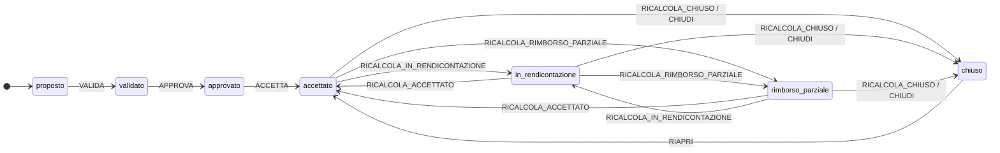
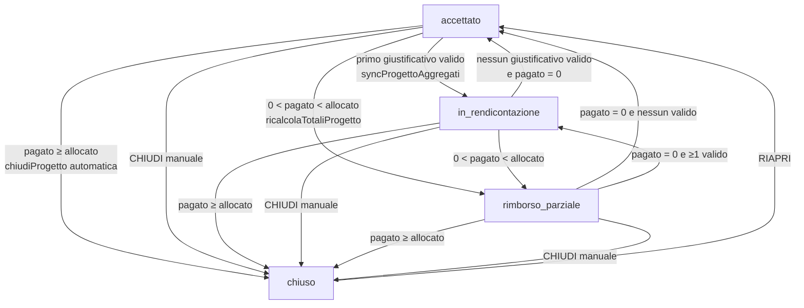
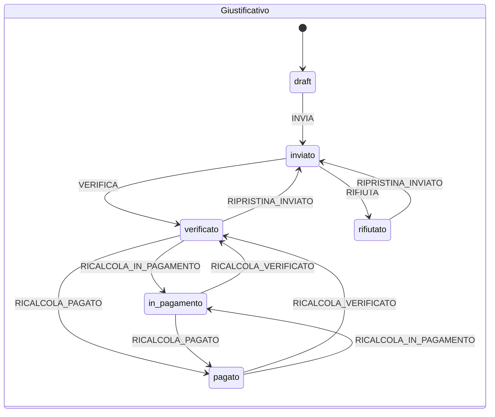
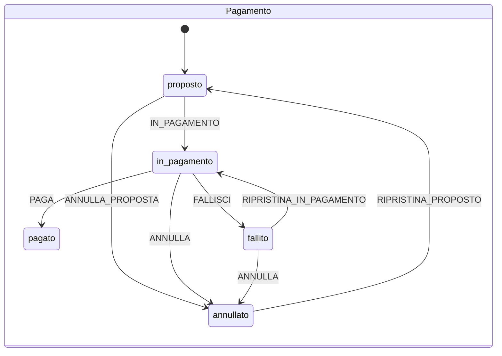

# Flussi di stato — ciclo di vita del progetto

Documento di riferimento sui flussi a partire da **progetto `accettato`**: quali
transizioni sono possibili, da cosa sono innescate, quali effetti collaterali
producono e dove si trovano gli entry point nell'interfaccia.

Fonti di verità (nessuna logica duplicata qui):

- Macchine a stati: `src/state-machines/{progetto,giustificativo,pagamento,submission}.js`
- Primitiva unica di scrittura: `src/usecases/stato/transita.js`
- Derivazione stato progetto: `src/utils/statoProgetto.js` (`calcolaStatoProgetto`)
- Use case: `src/usecases/{progetti,giustificativi,pagamenti}.js`

## Come visualizzarlo

- **GitHub**: i blocchi `mermaid` sono renderizzati nativamente (file view,
  PR, issue). Basta aprire questo file su `github.com/prinapo/volontari`.
- **VS Code**: con la versione **≥ 1.121** il preview Markdown renderizza Mermaid
  senza estensioni — apri il file e premi `Ctrl+Shift+V` (o `Ctrl+K V` per il
  side preview). Su versioni precedenti installa un'estensione Mermaid
  (`bierner.markdown-mermaid`, deprecata ma funzionante, oppure
  `vstirbu.vscode-mermaid-preview`).

---

## 1. Concetti e legenda

**Stati del progetto** (`STATO_PROGETTO`):

| Gruppo       | Stati                                                  | Operativo?                        |
| ------------ | ------------------------------------------------------ | --------------------------------- |
| Fase manuale | `proposto` → `validato` → `approvato`                  | no                                |
| Operativi    | `accettato`, `in_rendicontazione`, `rimborso_parziale` | **sì** (si creano giustificativi) |
| Finale       | `chiuso`                                               | no                                |

- `accettato` è **anche lo stato di nascita**: `creaProgetto` crea direttamente
  in `accettato` (`creaConStato`). È l'equivalente operativo del legacy `aperto`
  (normalizzato da `statoProgettoEffettivo`).
- `rimborso_parziale` è **operativo**: la famiglia può ancora inserire
  giustificativi fino al rimborso totale.
- `chiuso` è l'**unico stato finale** ed è **sticky**: `calcolaStatoProgetto` non
  lo retrocede mai a `rimborso_parziale`.
- `Giustificativi.Invalidato` è un flag **ortogonale** allo `Stato`: non è uno
  stato macchina e non compare nei diagrammi di stato.

**Regole di ingaggio del codice**:

- Ogni cambio di stato passa **solo** da `transita()` (o `creaConStato` /
  `creaConStatoIniziale`). Nessuno store/componente scrive `StatoProgetto` o
  `Stato` direttamente (vietato da ESLint `no-restricted-syntax`).
- I valori **derivati** (`StatoProgetto`, `StatoRendicontazione`, totali) sono
  calcolati da selettori puri a partire da dati freschi.

---

## 2. Macchina Progetto (transizioni dichiarate)

Legenda eventi:

| Evento                           | Significato                                             |
| -------------------------------- | ------------------------------------------------------- |
| `VALIDA` / `APPROVA` / `ACCETTA` | avanzamento fase manuale (un solo step, solo in avanti) |
| `RICALCOLA_*`                    | transizione **automatica/derivata** (idempotente)       |
| `CHIUDI`                         | chiusura **manuale** ("Chiudi progetto")                |
| `RIAPRI`                         | riapertura manuale da `chiuso`                          |

> Nota: `[*] --> proposto` è l'`initial` della macchina. I progetti **nuovi**
> non passano da `proposto`: `creaProgetto` li crea in `accettato`. La fase
> manuale serve per progetti che arrivano in quegli stati (import) e avanza con
> `avanzaStatoProgetto`.

---

## 3. Regole di derivazione (`calcolaStatoProgetto`)

Lo stato atteso è calcolato in quest'ordine (la prima regola che scatta vince):

| #   | Condizione                                                                | Risultato             |
| --- | ------------------------------------------------------------------------- | --------------------- |
| 1   | `StatoProgetto` nullo o legacy `aperto`                                   | base `accettato`      |
| 2   | stato attuale ∈ {`proposto`,`validato`,`approvato`}                       | **resta invariata**   |
| 3   | `allocato > 0` **e** `rimborsato ≥ allocato`                              | `chiuso` (auto)       |
| 4   | stato attuale = `chiuso`                                                  | `chiuso` (**sticky**) |
| 5   | `0 < rimborsato < allocato`                                               | `rimborso_parziale`   |
| 6   | esiste ≥1 giustificativo **valido** (non invalidato, `inviato`/contabile) | `in_rendicontazione`  |
| 7   | altrimenti                                                                | `accettato`           |

- `rimborsato` = somma dei pagamenti in stato `pagato` (`TotalePagato`).
- "giustificativo valido" = `Stato ∈ {inviato, verificato, in_pagamento, pagato}`
  e `Invalidato ≠ true`. I `draft` **non** contano.

---

## 4. Flusso integrato da `accettato`

### 4.1 Chi causa le transizioni (macchine "driver")

Il progetto non cambia mai stato "da solo": sono le mutazioni dei suoi
giustificativi e dei suoi pagamenti a innescare i ricalcoli.

**Ponte driver → progetto**:

- un giustificativo diventa `inviato`/contabile → `syncProgettoAggregati` →
  progetto `in_rendicontazione`;
- un pagamento diventa `in_pagamento`/`pagato`/`fallito`/`annullato` →
  `ricalcolaTotaliProgetto` → progetto `rimborso_parziale` o `chiuso`.

---

## 5. Tutti i casi possibili da `accettato`

| Da                   | Evento                         | Condizione                             | A                    | Causa (azione)                                    | Entry point UI                                                  | Side-effect                                                     |
| -------------------- | ------------------------------ | -------------------------------------- | -------------------- | ------------------------------------------------- | --------------------------------------------------------------- | --------------------------------------------------------------- |
| `accettato`          | `RICALCOLA_IN_RENDICONTAZIONE` | ≥1 giustificativo valido, `pagato = 0` | `in_rendicontazione` | crea / invia / verifica / aggiorna giustificativo | volontario → `giustificativi.store`; manager → `verifica.store` | `syncProgettoAggregati`                                         |
| `accettato`          | `RICALCOLA_RIMBORSO_PARZIALE`  | `0 < pagato < allocato`                | `rimborso_parziale`  | pagamento parziale                                | `PagamentiTab` → `pagamenti.store`                              | `ricalcolaTotaliProgetto` + `sincronizzaStatiPagamentoProgetto` |
| `accettato`          | `RICALCOLA_CHIUSO`             | `allocato > 0` e `pagato ≥ allocato`   | `chiuso` (auto)      | segna pagato che raggiunge il cap                 | `PagamentiTab` → `pagamenti.store.segnaPagato`                  | `ricalcolaTotaliProgetto` → `chiudiProgetto({automatica:true})` |
| `accettato`          | `CHIUDI`                       | —                                      | `chiuso` (manuale)   | "Chiudi progetto"                                 | `RendicontazioneTab` → `pagamenti.store.chiudiProgetto`         | set `DataChiusura`, `MotivoChiusura`                            |
| `in_rendicontazione` | `RICALCOLA_ACCETTATO`          | nessun valido e `pagato = 0`           | `accettato`          | invalida / elimina l'ultimo giustificativo valido | volontario → `giustificativi.store`                             | `syncProgettoAggregati`                                         |
| `in_rendicontazione` | `RICALCOLA_RIMBORSO_PARZIALE`  | `0 < pagato < allocato`                | `rimborso_parziale`  | pagamento parziale                                | `PagamentiTab`                                                  | `ricalcolaTotaliProgetto` + `sincronizzaStatiPagamentoProgetto` |
| `in_rendicontazione` | `RICALCOLA_CHIUSO`             | `pagato ≥ allocato`                    | `chiuso` (auto)      | segna pagato che raggiunge il cap                 | `PagamentiTab`                                                  | `ricalcolaTotaliProgetto` → `chiudiProgetto({automatica:true})` |
| `in_rendicontazione` | `CHIUDI`                       | —                                      | `chiuso` (manuale)   | "Chiudi progetto"                                 | `RendicontazioneTab`                                            | set `DataChiusura`, `MotivoChiusura`                            |
| `rimborso_parziale`  | `RICALCOLA_ACCETTATO`          | `pagato = 0` e nessun valido           | `accettato`          | annullo pagamenti + nessun giustificativo valido  | `PagamentiTab` / volontario                                     | `ricalcolaTotaliProgetto` / `syncProgettoAggregati`             |
| `rimborso_parziale`  | `RICALCOLA_IN_RENDICONTAZIONE` | `pagato = 0` e ≥1 valido               | `in_rendicontazione` | annullo pagamenti (restano giustificativi validi) | `PagamentiTab`                                                  | `ricalcolaTotaliProgetto`                                       |
| `rimborso_parziale`  | `RICALCOLA_CHIUSO`             | `pagato ≥ allocato`                    | `chiuso` (auto)      | segna pagato che raggiunge il cap                 | `PagamentiTab`                                                  | `ricalcolaTotaliProgetto` → `chiudiProgetto({automatica:true})` |
| `rimborso_parziale`  | `CHIUDI`                       | —                                      | `chiuso` (manuale)   | "Chiudi progetto"                                 | `RendicontazioneTab`                                            | set `DataChiusura`, `MotivoChiusura`                            |
| `chiuso`             | `RIAPRI`                       | —                                      | `accettato`          | "Riapri progetto"                                 | `RendicontazioneTab` → `pagamenti.store.riapriProgetto`         | azzera `DataChiusura`, `MotivoChiusura`                         |

---

## 6. Transizioni NON possibili

| Tentativo                                           | Esito                                                               |
| --------------------------------------------------- | ------------------------------------------------------------------- |
| `accettato` → `proposto`/`validato`/`approvato`     | **impossibile**: la fase manuale non retrocede                      |
| `chiuso` → `in_rendicontazione`/`rimborso_parziale` | **impossibile**: da `chiuso` esiste solo `RIAPRI` → `accettato`     |
| `avanzaStatoProgetto` da `accettato` o oltre        | lancia `TransizioneNonValidaError` ("progetto non in fase manuale") |
| Creare un progetto in stato ≠ `accettato`           | `creaConStato` valida lo stato dichiarato (solo `accettato`)        |
| Modificare `StatoProgetto` fuori da `transita`      | bloccato da ESLint `no-restricted-syntax`                           |

---

## 7. Catene di side-effect (invarianti)

| Funzione                                | Innescata da                                                                                          | Cosa fa                                                                                                                |
| --------------------------------------- | ----------------------------------------------------------------------------------------------------- | ---------------------------------------------------------------------------------------------------------------------- |
| `syncProgettoAggregati(progettoId)`     | **ogni** mutazione di giustificativo (crea, invia, aggiorna, verifica, rifiuta, invalida, riconcilia) | Ricalcola `TotaleGiustificativi`, `TotaleImporto`, `StatoRendicontazione`, `StatoProgetto` da dati freschi e PATCHa    |
| `ricalcolaTotaliProgetto(progettoId)`   | ogni cambio di pagamento, `ricalcolaProposta`, bulk RICALCOLA                                         | Ricalcola `TotaleVerificato/Proposto/InPagamento/Pagato/ResiduoAllocato`; **chiude** il progetto se il cap è raggiunto |
| `sincronizzaStatiPagamentoProgetto(id)` | `segnaInPagamento`/`segnaPagato`/`segnaFallito`/`segnaAnnullato`/`ripristina*`                        | Riallinea gli stati dei giustificativi contabili al pagamento collegato (e al cap allocato)                            |
| `ricalcolaProposta(progettoId)`         | verifica/rifiuta/aggiorna campo (manager), `segnaAnnullato`                                           | Crea/aggiorna/annulla il pagamento `proposto`; collega/scollega i giustificativi; poi ricalcola totali                 |
| `ricalcolaPropostiDaProgetti(rows)`     | pulsante "RICALCOLA"                                                                                  | Versione bulk di `ricalcolaProposta` sui progetti operativi                                                            |
| `chiudiProgetto(id, {automatica})`      | cap raggiunto (auto) o "Chiudi progetto" (manuale)                                                    | `transita` con `RICALCOLA_CHIUSO` o `CHIUDI`; set `DataChiusura`/`MotivoChiusura`                                      |
| `riapriProgetto(id)`                    | "Riapri progetto"                                                                                     | `transita` con `RIAPRI`; azzera `DataChiusura`/`MotivoChiusura`                                                        |
| `inviaNotificaPagamento(pagamento)`     | dopo `segnaPagato`                                                                                    | Invia l'email al volontario/genitore e marca `NotificaInviata`                                                         |

**Ordine tipico di `segnaPagato`** (`usecases/pagamenti.js`):

1. `transita(PAGA)` sul pagamento → `pagato`
2. `ricalcolaTotaliProgetto` (può chiudere il progetto automaticamente)
3. `sincronizzaStatiPagamentoProgetto` (giustificativi → `pagato`)
4. `inviaNotificaPagamento`

**Ordine tipico della verifica giustificativo** (`stores/verifica.store.js`):

1. `verificaGiustificativo` → `transita(VERIFICA)` + `syncProgettoAggregati`
2. `pagamenti.store.ricalcolaProposta(progettoId)` → aggiorna il `proposto`

---

## 8. Mappa eventi → entry point

| Evento / azione                 | Use case                                    | Store                                     | UI                                                    |
| ------------------------------- | ------------------------------------------- | ----------------------------------------- | ----------------------------------------------------- |
| Crea progetto (`accettato`)     | `creaProgetto`                              | `admin.store` / pagina                    | `CreaProgettoPage`                                    |
| Avanza fase manuale             | `avanzaStatoProgetto`                       | `pagamenti.store`                         | `RendicontazioneTab` ("Avanza stato progetto")        |
| Chiudi progetto (manuale)       | `chiudiProgetto`                            | `pagamenti.store`                         | `RendicontazioneTab` ("Chiudi progetto")              |
| Riapri progetto                 | `riapriProgetto`                            | `pagamenti.store`                         | `RendicontazioneTab` ("Riapri progetto")              |
| Crea gruppo di pagamento        | `segnaInPagamento`                          | `pagamenti.store.creaBatch`               | `PagamentiTab` ("Crea gruppo di pagamento")           |
| Segna pagato                    | `segnaPagato`                               | `pagamenti.store`                         | `PagamentiTab` ("Segna pagato")                       |
| Segna fallito                   | `segnaFallito`                              | `pagamenti.store`                         | `PagamentiTab` ("Segna fallito")                      |
| Rimuovi dal gruppo / annulla    | `segnaAnnullato`                            | `pagamenti.store`                         | `PagamentiTab` ("Rimuovi dal gruppo")                 |
| Ripristina a "Bonifici da fare" | `ripristinaProposto`                        | `pagamenti.store`                         | `PagamentiTab` ("Ripristina")                         |
| Ripristina a "Da riscontrare"   | `ripristinaInPagamento`                     | `pagamenti.store`                         | `PagamentiTab` ("Ripristina")                         |
| Ricalcola proposte (bulk)       | `ricalcolaPropostiDaProgetti`               | `pagamenti.store`                         | `PagamentiTab` ("RICALCOLA")                          |
| Verifica giustificativo         | `verificaGiustificativo`                    | `verifica.store`                          | `RendicontazioneTab` / `Verifica` (azione "Verifica") |
| Rifiuta giustificativo          | `rifiutaGiustificativo`                     | `verifica.store`                          | `RendicontazioneTab` / `Verifica` (azione "Rifiuta")  |
| Invia bozza giustificativo      | `inviaGiustificativo`                       | `giustificativi.store`                    | card giustificativo (volontario)                      |
| Ripristina a `inviato`          | `aggiornaCampoGiustificativo`               | `verifica.store` / `giustificativi.store` | azione "Ripristina"                                   |
| Invalida giustificativo         | `invalidaGiustificativo`                    | `giustificativi.store`                    | card giustificativo (volontario)                      |
| Crea giustificativo             | `creaGiustificativo`                        | `giustificativi.store` / `verifica.store` | form giustificativo (volontario/verificatore)         |
| Crea submission (modulo libero) | `creaSubmission`                            | `submit.store`                            | `SubmitPage`                                          |
| Riconcilia submission           | `riconciliaSubmission`                      | `verifica.store`                          | `RiconciliazionePage`                                 |
| Scarta / ripristina submission  | `scartaSubmission` / `ripristinaSubmission` | `verifica.store`                          | `RiconciliazionePage`                                 |

---

## 9. Verifiche e note

- **`RICALCOLA_ACCETTATO`** è realmente emesso: da `in_rendicontazione` o
  `rimborso_parziale` quando i giustificativi validi spariscono e non ci sono
  pagamenti (`eventoRicalcoloProgetto('accettato')`).
- **`chiuso` sticky**: `syncProgettoAggregati` su un progetto `chiuso` calcola
  sempre `chiuso` come target, quindi la condizione `statoRaw === statoProgetto`
  è vera e viene fatta solo la PATCH dei derivati (nessuna transizione).
- **Legacy `aperto`**: `statoProgettoEffettivo` lo normalizza a `accettato`
  **prima** di interrogare la macchina; un eventuale residuo legacy non deve
  essere scritto di nuovo (la scrittura del branch legacy è stata rimossa).
- **Modulo libero**: la submission **non** crea giustificativi; la
  materializzazione avviene solo alla riconciliazione, che crea un
  giustificativo `inviato` (quindi il progetto passa a `in_rendicontazione`).
- **`Rendicontazioni.Stato`** non è un'entità a macchina: resta un valore
  scritto direttamente (eccezione ESLint documentata).
